# Mark's Kitchen - A True Culinary Experience

[Please see my live app here!](https://marks-kitchen.herokuapp.com/)

## 1. Purpose of the project
The purpose of this project was to design a website for a new up and coming restaurant (Mark's Kitchen) who wanted to maximise their potential reach by promoting their retaurant online so it would be visible to as many potential customers as possible. This site would also allowed a user, who is registered for an account, to post a review of their experience at the location for all site visitors to see. The user also has the ability to edit and delete these revies if they wish to do so. This site also allows a registered user to make a booking request directly to the site owner via a form submission which would then be stored in the sites database where it would await approval. The site also gives the owner the ability to show off the restaurant's menu in all it glory as well as the ability be easily update and change the dishes / contents as they evolve over time. 

This project was my first time developing with the Django framework and was a huge undertaking for me, grasping the basic concepts was something that didn't come easy and I still have a lot more to learn on my Django journey.

## 2. User stories

The user stories for this project were written and managed using the agile kanban board function within my GitHub repository [Link here!](https://github.com/MarkReddy87/marks-kitchen/projects/1) 

I found this tool very rewarding. I was able to see my progress as I worked through each user story and moving them across each column after completion was very satisfying. Below is a list of the user stories I created:

As a site user I can view the restaurant menu so that I can see what dishes are available and at what price.
As a site user I can create an account so that I can make and save my booking.
As site admin I can confirm a booking so that I can avoid double booking a table for a specific time.
As a site user I can log into my account so that I can save my details.
As a site user I can contact the restaurant so that I can submit a review or ask a question.
As a site user I can make a booking for one or more people so that I can reserve a table for a specific date and time to have a meal.

## 3. Features

### 3.1 Main Site Features

This project is a multi-page Django app. The home page has an eye catching feature image containing a welcome message as well as a sleek responsive navagation bar which is consistant across all pages. The landing page also contains the restaurants full menu for all site visitors to see.

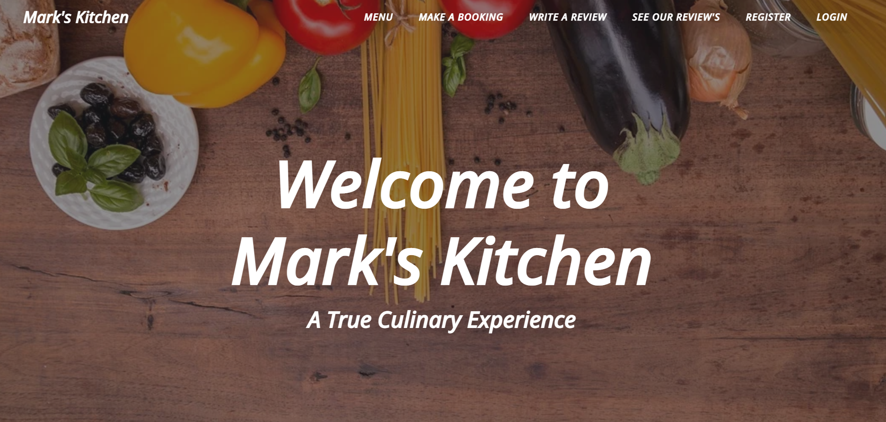

Any site visitor is given the opportunity to register for an account which unlocks further features within the site.

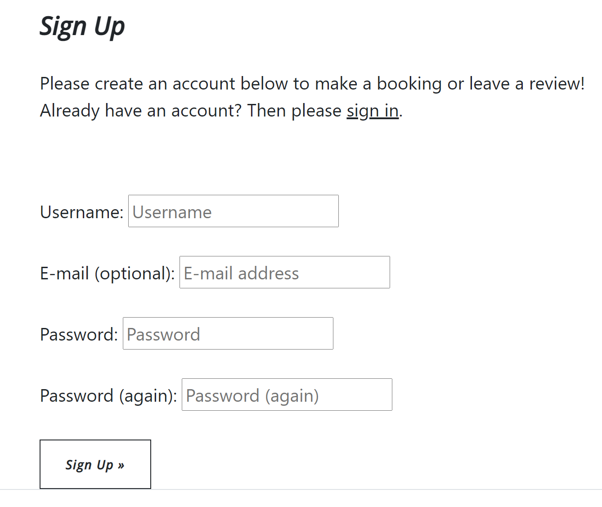

A returning user who is already registered with can navigate to the login page and once the form is completed all the features of the site will be unlocked. 

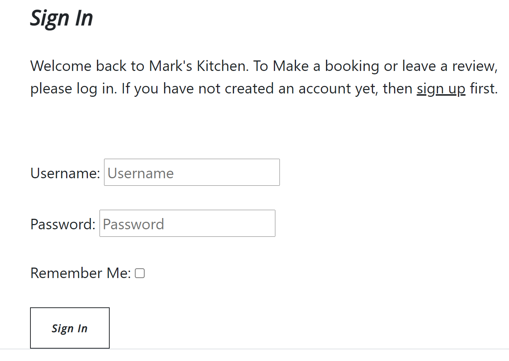

Any unregistered site visitor can navigate to the "see our reviews" page where there is a collection of reviews which have been left by registers users who have had an experience's with Mark's kitchen in the past. 

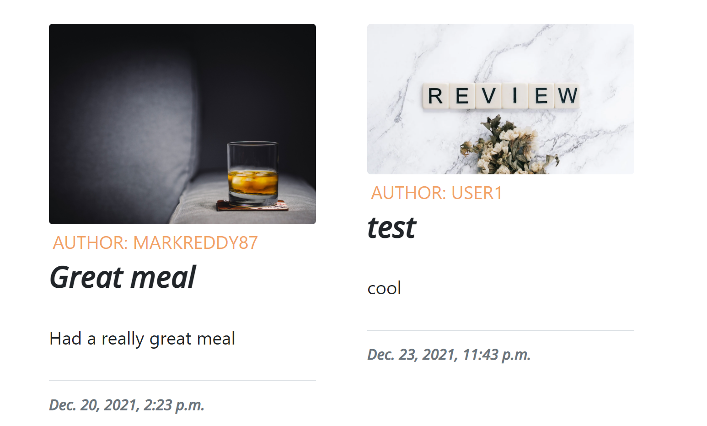

If the user is registered they can login upon returning to the site and navigate to the "make a booking" page where a form will now be unlocked which will take all the necessary details from the user to make a booking in the restaurant. 

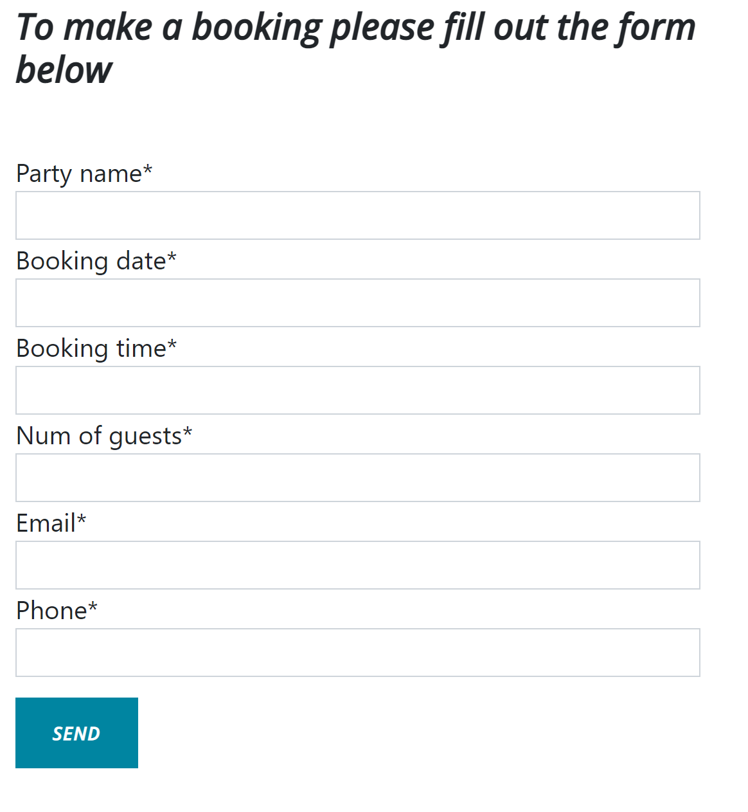

Once the user has correctly filled out the form the data is submitted and sved to the database where it will await approval from the site admin.

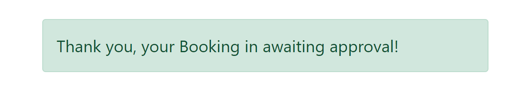

Also if the user is registered they can login and navigate to the "write a review page" where another from will now be unlocked. This form give the user the ability to leave a review of the restaurant and allows them to attach an image of their experience if they wish to do so. If no image is supplied the site will automatically attach a placeholer image for them.

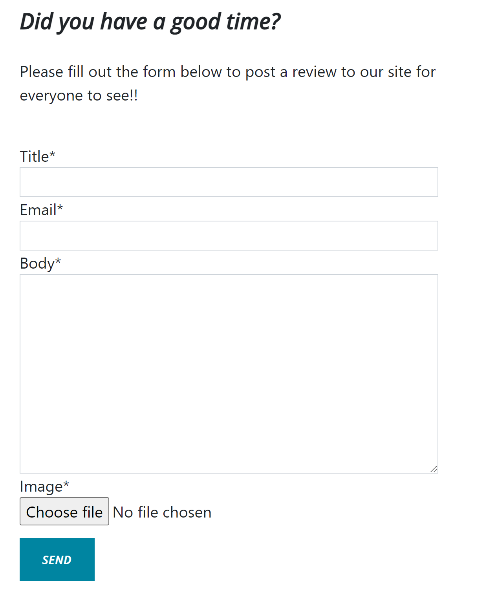

Once the review form is correctly filled out the user will get an alert message telling them the review is awaiting approval and when approved by the admin the users review will appear on the sites "see our reviews" page for any site visitor to see. 

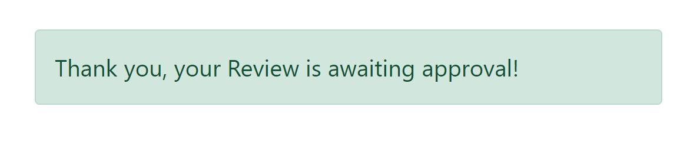

When the review has been approved on the admin panel by the site owner it will appear on the "see out review's page and is a clickable link which takes you to the review detail page showing the full body of the review and if the user that is logged in matches the author of the review two extra buttons will appear giving the options to edit or delete that specific review.

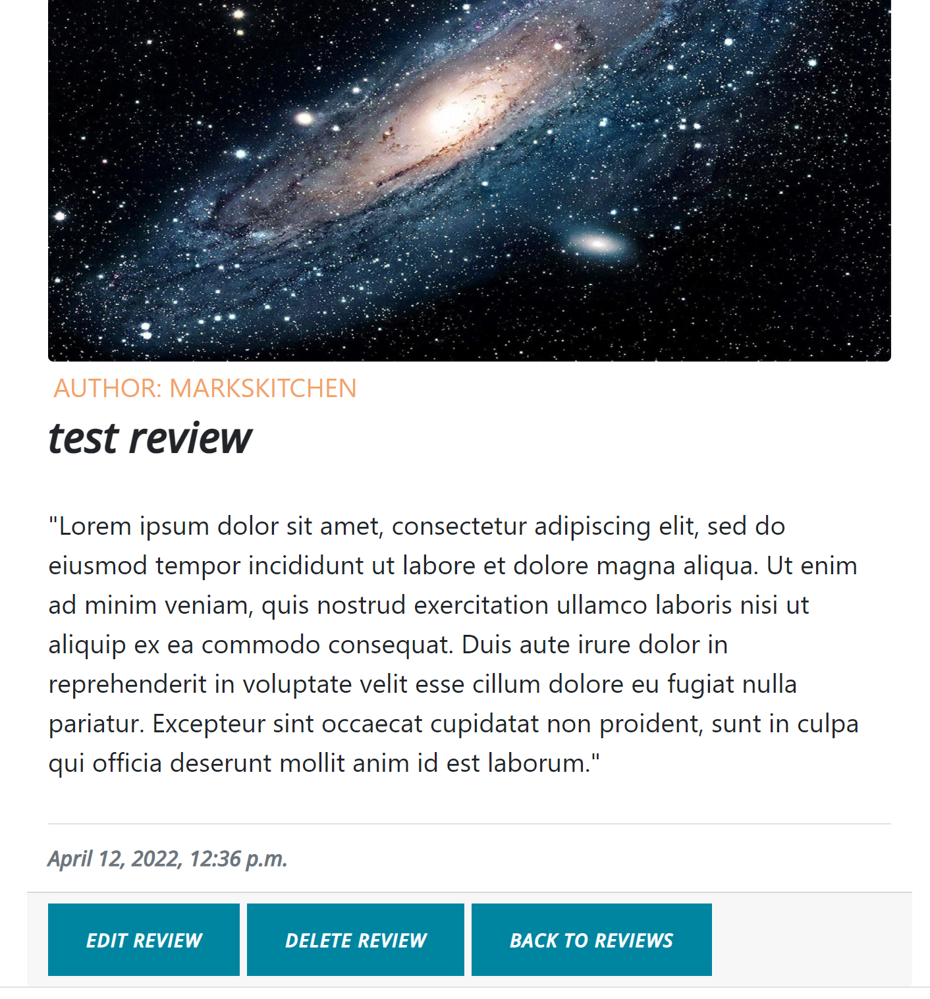

If the edit review button is clicked it will bring up an instance the contact form of that specific review which can be edited / updated by the user and once the save changes button is clicked the form will be saved and posted to the site.

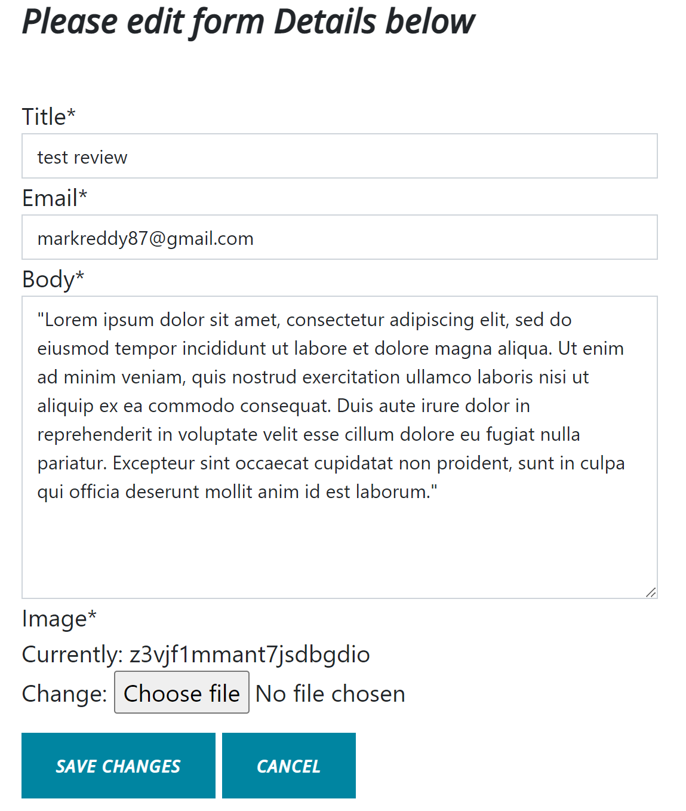

If the delete button is clicked the user is presented with a warning page asking them to confirm the deletion or to cancel and go back to the reviews page. This gives the user a chance to assess their decision before actually deleting the review.

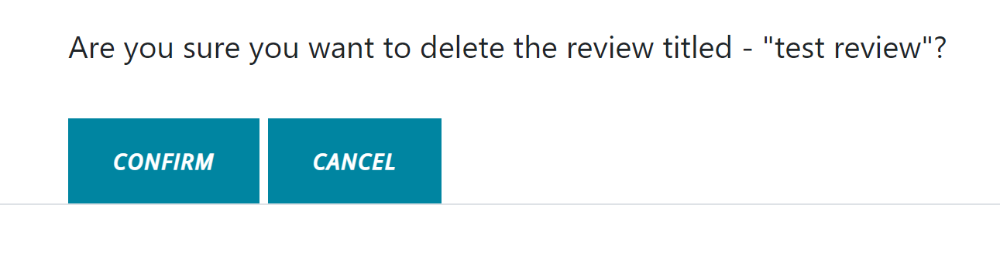

The site also has fully responsive footer containing all the social media links, among others, styled with icons from [Font Awsome](https://fontawesome.com/).

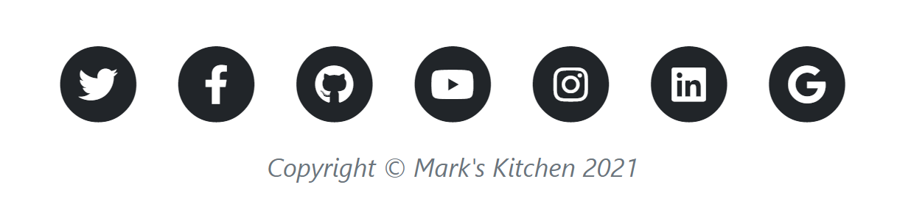

Finally the user can sign out of their account from the navigation bar if they wish to do so and will be prompted with a message asking them to confirm. Once confirmed the user is then redirected back to the home page.

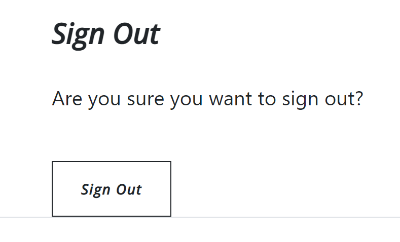

### 3.2 Security Features

One of the main security features present in this project is the use of the Cross-Site Request Forgery(csrf) token which is present on all forms across the site. This token is used to send requests to the server and is tied to the user's session allowing the forms to be validated and protect the data against cross-site request forgery.

Another security feature present in this project is the use of a django super user. This is created in the development enviornment with a Username, Email and Password. We type the command "python3 manage.py createsuperuser" into the terminal within the GitHub workspace and follow the prompts to create the account. Once created this gives the user full access to the admin panel of the site allowing them to create, edit and delete data in the database.

The site is designed in a way so that only registered users can access the functionality of the site when it comes to making a booking or writing a review. This was achieved by using a simple if/else statement withing the html templates and only displaying the crispy form content if the user is authenticated. If not the user is prompted to register for an account to gain full access.

Another security feature implemented is only giving users the ability to edit and delete their own reviews. This was achieved via the newly added review detail page where the we check if the user who is logged in matches the author of the review and if so an extra set of buttons is displayed below the review itself allowing editing and deletion of that review.

## 4. Future Features

When thinking of potential future features to add to this site the possibilities are almost endless because of the versatility of the Django framework and I have only touched the surface of what it can do. 

I would start with an interactive gallery page which contained up to date images of the reataurant premises, menu contents and of the owner / staff with accompanying profiles. This would give the site users a great visual understanding of the restaurant as well a more far personal experience by getting to know the owner and staff without ever having visited the restaurant.

Another feature I would like to add would be a page consisting of a payment system where a user could purchase a voucher for the restaurant which would be automatically sent to their email address and could be used upon arrival. 

## 5. Typography and color scheme

For this site I chose to use a bootstrap theme called "clean blog" which was downloaded from the [Start Bootstrap](https://startbootstrap.com/) website. This theme added such value to the site asthetics on so many levels. I wanted a very sleek but simple design which was also very responsive and intuative at the same time and I feel this theme did it all. I modified the html code in theme from its original state and used custom images and CSS to make it my own but the theme helped getting the navigation bar and the footer to look the way I wanted it to. 

I chose to use simple and contrasting colors which I think helps the sites readability and promotes a positive user response. The two [Google Fonts](https://fonts.google.com/) I used which I thought paired well together were Lato and Open Sans.

## 6. Wireframes

[Link to Project Wireframes](https://balsamiq.cloud/s1wvfc3/p8hftjs/r1F97).

I found using Balsamiq wireframes very beneficial. This is a great tool to use during the project inception. It allows the user to plan out every page you want to create with great detail and with the variety elements to choose from I feel it can inspire you to come up with new ideas. After creating my wireframes I found myself using them as a constant reference during the coding process.

## 7. Technology

* [HTML](https://en.wikipedia.org/wiki/HTML)
* [CSS](https://en.wikipedia.org/wiki/CSS)
* [JavaScript](https://en.wikipedia.org/wiki/JavaScript)
* [Python](https://en.wikipedia.org/wiki/Python_(programming_language))
* [Django](https://en.wikipedia.org/wiki/Django_(web_framework))
* [PostgreSQL](https://en.wikipedia.org/wiki/PostgreSQL)

## 8. Testing

   ### 8.1 code validation

   * HTML - No fatal erros were returned when HTML code was passed through the official [W£C Validator](https://validator.w3.org/#validate_by_input)
   * CSS - No errors were returned when the CSS code was passed through the official [Jigsaw Validator](https://jigsaw.w3.org/css-validator/#validate_by_input)
   * Python - No errors were returned when the Python code was passed through the [Python Syntax Chacker](https://extendsclass.com/python-tester.html)

   Extensive manual testing was done on the finished site to make sure that the data entered into the forms was save correctly to the database and when the data had been approved by the site admin it was then properly displayed on the relevant pages within the site. 
   
   1. Firstly once the app was successfully deployed to heroku I began the resistration process and set up a new account by clicking the register button in the top left of the screen and entering the required information in the form shown on screen. Once registered the user is then redirected to the home page as expected.
   2. Now that I was logged in as a registered user I had full access to all the sites capabilities and would be able to leave a review and make a booking request. Upon clicking the write a review link at the top of the page I could access the contact form where I could enter the relevant details and add an accompanying picture if I chose to do so. To ensure all the code was working as expected I created two reviews, one with a picture attached and one without. I then logged into the sites admin where I could access the two recent reviews and approve each of them. Then back on the site I could navigate to the "see our reviews" page where the two reviews were now shown and I was able to see that the placeholder image was in fact working and present.
   3. From here I could test access to the review detail page. I wrote the code in such a way that the entire review card was clickable which worked and brings the user to another page displaying only that specific review including the reviews body.
   4. Once the review detail page was accessed I could tell the code for the edit and delete buttons code was working as both were rendered below the review. I furthur tested this functionality by logging out of my profile an navagating back to the review detail page a seeing that these button were no longer displayed.
   5. To test the ability to edit a review I logged back into my profile and navigated back to the review detail page and clicked on the edit review button which rendered an instance of the contact form prefilled with the current data save on te database for that specific review as ecpected. I then proceeded to change some of the data within the form fields and clicked the save changes button. The site then displayed the familiar success message and upon navigating back to the revies page I could see that the review had indeed been updated confirming the functionality. 
   6. Now I could test the delete function. From the review detail page of one of my test reviews I clicked the delete button which, as expected, brought me to the contact_confirm_delete page where I was given a chance to change my mind before confirming the delete. Once confirming I was redirected back to the reviews page where I could see the review was no longer there confirming the delete functoin worked as intended.
   7. Next I tested the booking form. Navigating to the "make a booking" tab shows the booking form where the logged in user can now fill out the required information to make a booking request. While filling this out I noticed a issue with the username field where all the registered users appeared in the dropdown menu and could be accessed by any logged in user. This issue needed to be addressed as this is considered a breach of defensive design. After this issue was removed a user could then submit the form for admin approval and once the button was clicked there were presented with a success message letting them know their form entry was a success. Now navigating to the site admin I could see that the booking had been created and as the site owner I could now approve the booking and contact the customer.

   ### 8.2 fixed bugs

   1. I came across a number of bugs during the development of this site. One particular case was when I was trying to display the images attached to the user reviews. After building the bootstrap cards to contain each review the images would display too large and were not contained within the cards themselves. After reviewing the bootstrap documentation relating to images I was able to apply the correct class (img-fluid) to the appropriate div elements to solve this issue.

   2. Another bug that came up was when registering for an account. Once the new account details had been entered and the form was submitted the site gave an internal server error and did not redirect the user back to the home page. To ammend this I added two variables into settings.py which were EMAIL_BACKEND and ACCOUNT_EMAIL_VERIFICATION. After applying both of these the function thankfully worked as intended.

   3. Another bug I had to tackle was only allowing registered users who were logged in to have access to the sites forms. After reviewing the relevant course content I was able to insert and if/else clause within the html template with an accompanying message prompting the user to sign in / register to gain full access to the site capabilities.

   4. There was also an issue in both forms where if there is multiple registered user they would all appear in the dropdown user_name fields. This could be considered a breach of defensive design. To combat this the name / user name fields were removed from both forms and within both respective post methods in views.py, before the form is saved, the user name is pulled from the current logged in user and attached to either the booking or the contact.

   5. To add the ability to edit a delete a review's I decided to add a slug field to the contact model to give each review their own unique identifier which I could then call. When I attempted to migrate this change I made an error when trying to add a default value to all of the existing lines in the database. I was uable to undo the mistake I made which resulted in me having to delete all my migration files and db.sqlite3 file and remigrate the entire project again. This was a mistake I will certainly not make again because at one point I thought there was no return but thanks to the help of the code institute tutor support they were able to guide me in the right direction.

   6. Also with the inclusion of the slugfield I had to add the ability for the admin to auto generate a slug from the title of the review which easily done in the admin.py file but this presented a problem when adding a review from the form on site itself. As no slug was auto generated from this version of the form when trying to access the reviews page with a user generated review present the site gave a NoReverseMatch error. It took me a long time to figure out what was causing this but after seeing there was no slug present for the review in the admin panel I understoof the issue. The solution to this was to add a save function under the Contact model which "slugified" the title of a user review and attached it to the Contact model before is was saved to the database thus solving the issue.

   7. The last bug I encountered was with the image field in the Contact form. I changed the model from a cloudinary field to an image field to try and solve an issue with Heroku not allowing the user to add images and giving a server error. It originally solved the issue within the Github workspace but not in Heroku. I reverted the model back to a Cloudinary field but left the changes I made in views.py in each post method which was to add the request.FILES attribute to the contact_form variable. These changes solved the issue and the functionality worked both in the workspace and in the Heroku app. 

   ### 8.3 supported screens and browsers

   The site was developed and tested with the Goggle Chrome browser.
   The bootstrap theme used in this site included media queries in the CSS file which makes the site fully responsive on all screen sizes by stacking elements on smaller screen widths as well as adding a dropdown menu within the navagation bar to hold all the relevant page links.

## 9. Deployment

### 9.1 via gitpod

This project was built entirely using [Github](https://github.com/) and [Gitpod](https://gitpod.io/).
* First I created a repository in my GitHub account and named it appropriately.
* Then I was able to create a GitPod workspace which included the Code Institute template where I was able to write and save all my code progress.

### 9.2 via heroku

This project was deployed as a Python based Django applcation on the Heroku cloud platform.
*  Firstly a new app was created on the Heroku site and named appropriately.
* Once the required packages were installed with the Gitpod workspace and added to the requirements.txt file I could then apply the correct settings to my Heroku app.
* Within the setting tab three different Config Vars were required: Cloudinary for hosting images, Postgres database for hosting all site data and the Secret Key url to hide any sensitive data in my workspace.
* The Gunicorn dyno was then added as well as the Heroku Postgres add-on.
* Once all these steps were done the we can then head to the deploy tab and link the respective GitHub repository to the app and now the project is ready to be built and deployed from the main Github branch.

## 10. Credits

* [Code Institute](https://codeinstitute.net/) for related course materail, tutor assistance and mentoring sessions.
* [Stack Overflow](https://stackoverflow.com/) for queries on code syntax.
* [w3schools](https://www.w3schools.com/) for further queries on code syntax.
* [GitHub](https://github.com/) for creating project repository.
* [Gitpod](https://gitpod.io/workspaces) for building the project in a workspace.
* [Heroku](https://heroku.com/) for deployinig the completed project.
* [PEP8](http://pep8online.com/) for validating all code within the project.
* [Slack](https://slack.com/) for help with deployment issues.
* [Start Bootstrap](https://startbootstrap.com/) for the bootstrap theme / template.
* [Google Fonts](https://fonts.google.com/) for the fonts used across the site.
* [Adobe Color](https://color.adobe.com/create/color-wheel) for picking colors for the site
* [Java T Point](https://www.javatpoint.com/) for code tutorials
* [Pixabay](https://pixabay.com/) for site inmages