# Mark's Kitchen - A True Culinary Experience

[Please see my live app here!](https://marks-kitchen.herokuapp.com/)

## 1. Purpose of the project
The purpose of this project was to design a website for a new up and coming restaurant (Mark's Kitchen) who wanted to maximise their potential reach by promoting their retaurant online so it would be visible to as many potential customers as possible. This site would also allowed a user, who is registered for an account, to post a review of their experience at the location for all site visitors to see. The user also has the ability to edit and delete these revies if they wish to do so. This site also allows a registered user to make a booking request directly to the site owner via a form submission which would then be stored in the sites database where it would await approval. The site also gives the owner the ability to show off the restaurant's menu in all it glory as well as the ability be easily update and change the dishes / contents as they evolve over time. 

This project was my first time developing with the Django framework and was a huge undertaking for me, grasping the basic concepts was something that didn't come easy and I still have a lot more to learn on my Django journey.

## 2. User stories

The user stories for this project were written and managed using the agile kanban board function within my GitHub repository [Link here!](https://github.com/MarkReddy87/marks-kitchen/projects/1) 

I found this tool very rewarding. I was able to see my progress as I worked through each user story and moving them across each column after completion was very satisfying. Below is a list of the user stories I created:

As a site user I can view the restaurant menu so that I can see what dishes are available and at what price.
As a site user I can create an account so that I can make and save my booking.
As site admin I can confirm a booking so that I can avoid double booking a table for a specific time.
As a site user I can log into my account so that I can save my details.
As a site user I can contact the restaurant so that I can submit a review or ask a question.
As a site user I can make a booking for one or more people so that I can reserve a table for a specific date and time to have a meal.

Upon finding out I had to resubmit my project I examined all the feedback given to me by the assor and created further user stories to address all the issues that had been brought up. I also implemented the use use of labels on the new user stories to seperate each new issue into easily seen catagories. I also ensured to close each issue when completed. Below I have listed all the new issues that were created:

As a site owner I must properly validate all python and HTML files so that all code is PEP8 complient (label - documentation)
As a site user I can add a personal image to a review so that I can enhance my review for the community (label - bug)
As a site user I must not be able to use any username in the data base as the author for my review so that I can protect my and other users reputation / data (label - bug)
As a site user I can delete my review so that remove it from the site if I decide to do so (label - enhancement)
As a site user I can edit or delete a review so that fix a mistake or remove a review at my discression (label - enhancement) 

## 3. Features

### 3.1 Main Site Features

This project is a multi-page Django app. The home page has an eye catching feature image containing a welcome message as well as a sleek responsive navagation bar which is consistant across all pages. The landing page also contains the restaurants full menu for all site visitors to see.

Any site visitor is given the opportunity to register for an account which unlocks further features within the site.

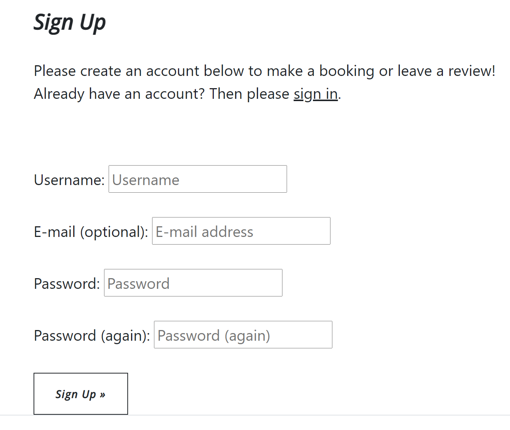

A returning user who is already registered with can navigate to the login page and once the form is completed all the features of the site will be unlocked. 

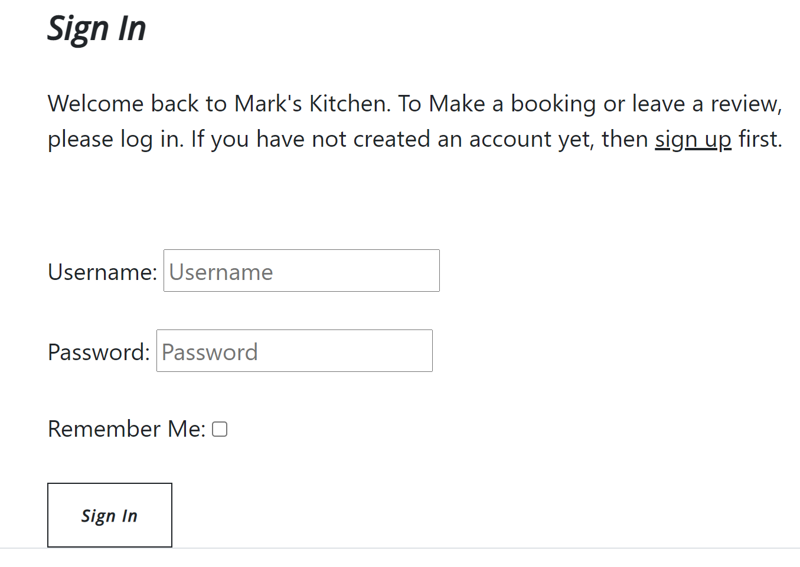

Any unregistered site visitor can navigate to the "see our reviews" page where there is a collection of reviews which have been left by registers users who have had an experience's with Mark's kitchen in the past. 

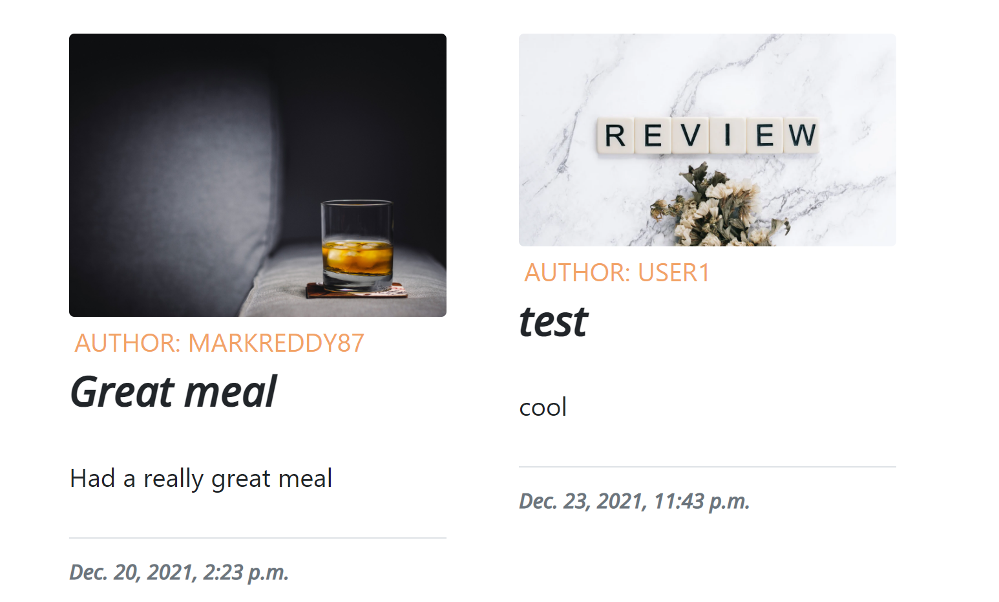

If the user is registered they can login upon returning to the site and navigate to the "make a booking" page where a form will now be unlocked which will take all the necessary details from the user to make a booking in the restaurant. 

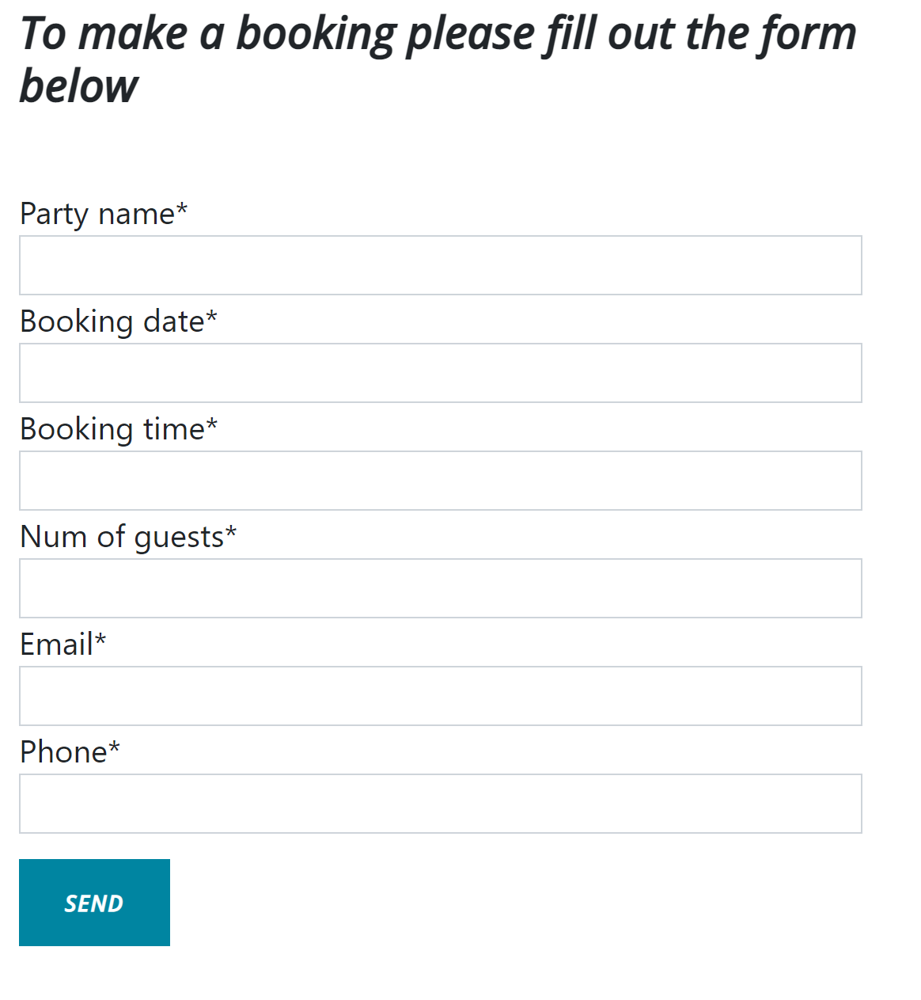

Once the user has correctly filled out the form the data is submitted and sved to the database where it will await approval from the site admin.

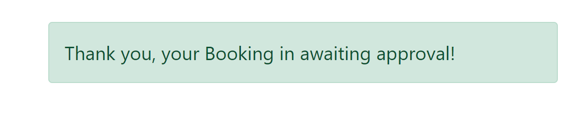

Also if the user is registered they can login and navigate to the "write a review page" where another from will now be unlocked. This form give the user the ability to leave a review of the restaurant and allows them to attach an image of their experience if they wish to do so. If no image is supplied the site will automatically attach a placeholer image for them.

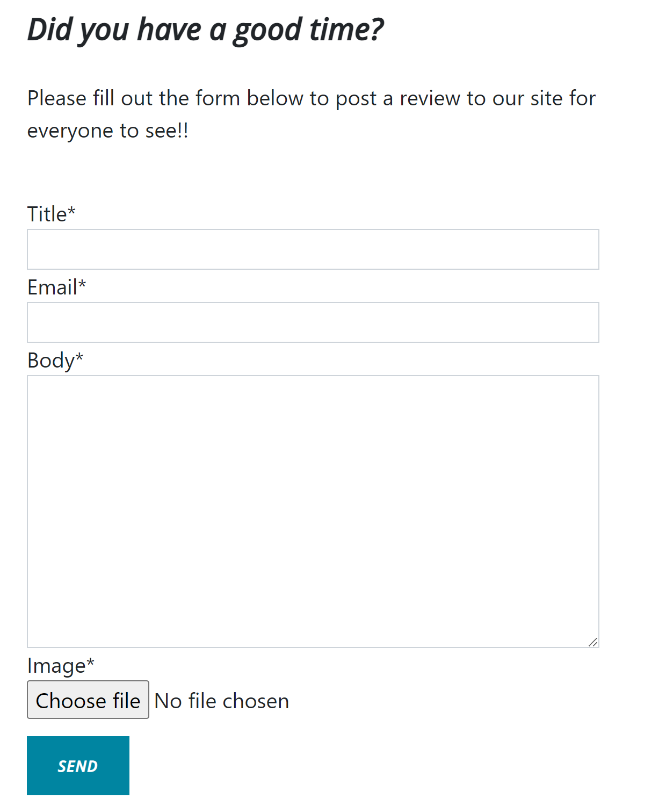

Once the review form is correctly filled out the user will get an alert message telling them the review is awaiting approval and when approved by the admin the users review will appear on the sites "see our reviews" page for any site visitor to see. 

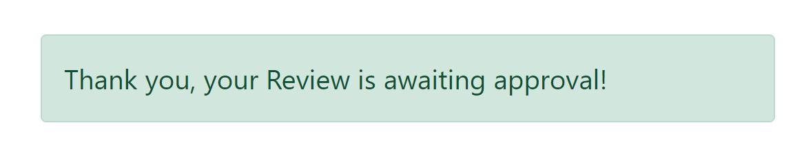

When the review has been approved on the admin panel by the site owner it will appear on the "see out review's page and is a clickable link which takes you to the review detail page showing the full body of the review and if the user that is logged in matches the author of the review two extra buttons will appear giving the options to edit or delete that specific review.

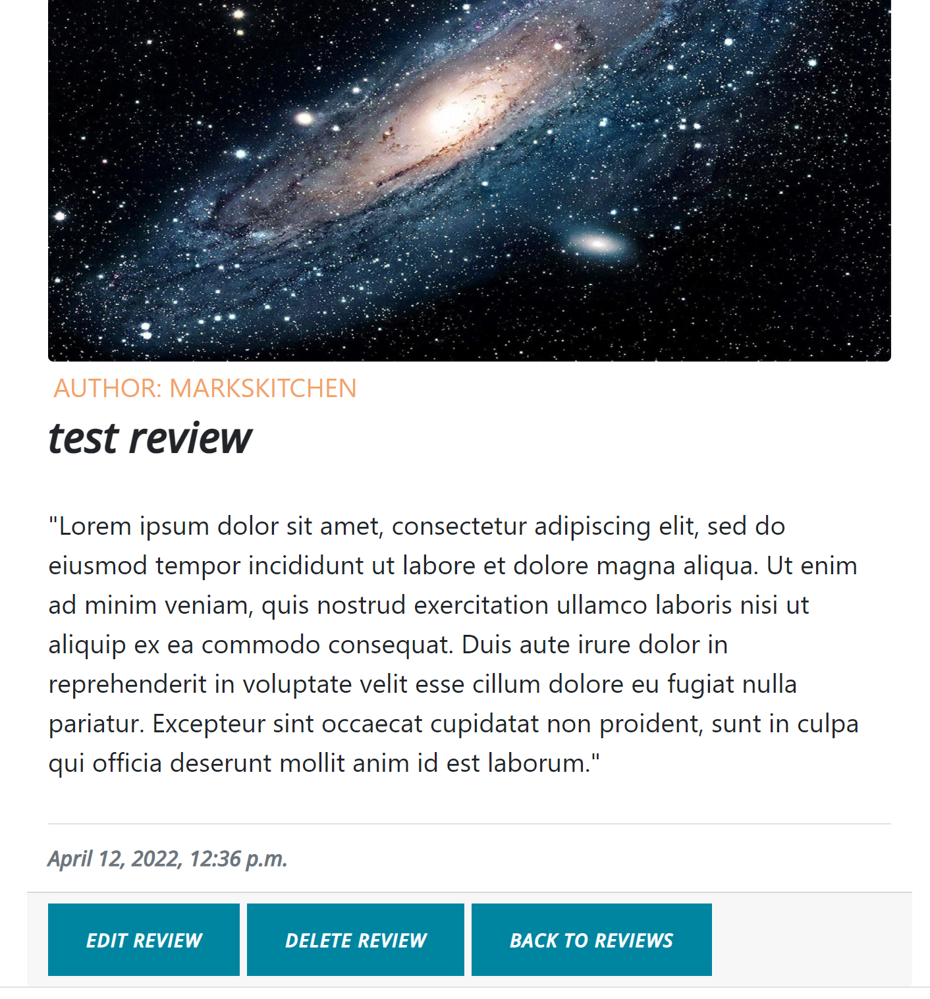

If the edit review button is clicked it will bring up an instance the contact form of that specific review which can be edited / updated by the user and once the save changes button is clicked the form will be saved and posted to the site.

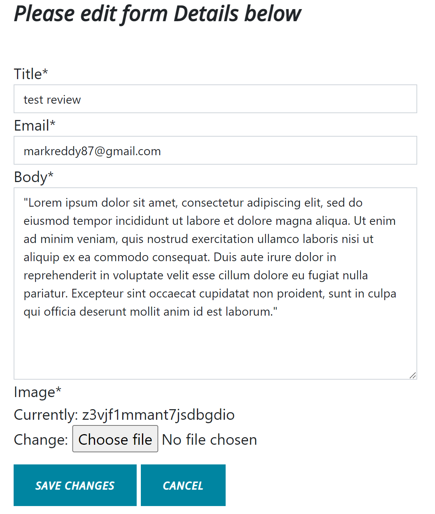

If the delete button is clicked the user is presented with a warning page asking them to confirm the deletion or to cancel and go back to the reviews page. This gives the user a chance to assess their decision before actually deleting the review.

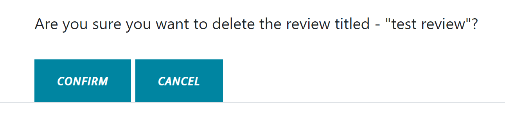

The site also has fully responsive footer containing all the social media links, among others, styled with icons from [Font Awsome](https://fontawesome.com/).

Finally the user can sign out of their account from the navigation bar if they wish to do so and will be prompted with a message asking them to confirm. Once confirmed the user is then redirected back to the home page.

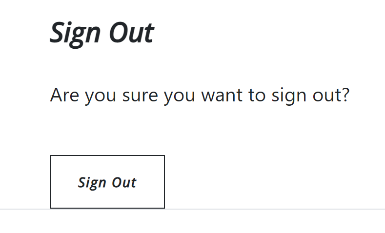

### 3.2 Security Features

One of the main security features present in this project is the use of the Cross-Site Request Forgery(csrf) token which is present on all forms across the site. This token is used to send requests to the server and is tied to the user's session allowing the forms to be validated and protect the data against cross-site request forgery.

Another security feature present in this project is the use of a django super user. This is created in the development enviornment with a Username, Email and Password. We type the command "python3 manage.py createsuperuser" into the terminal within the GitHub workspace and follow the prompts to create the account. Once created this gives the user full access to the admin panel of the site allowing them to create, edit and delete data in the database.

The site is designed in a way so that only registered users can access the functionality of the site when it comes to making a booking or writing a review. This was achieved by using a simple if/else statement withing the html templates and only displaying the crispy form content if the user is authenticated. If not the user is prompted to register for an account to gain full access.

Another security feature implemented is only giving users the ability to edit and delete their own reviews. This was achieved via the newly added review detail page where the we check if the user who is logged in matches the author of the review and if so an extra set of buttons is displayed below the review itself allowing editing and deletion of that review.

## 4. Future Features

When thinking of potential future features to add to this site the possibilities are almost endless because of the versatility of the Django framework and I have only touched the surface of what it can do. 

I would start with an interactive gallery page which contained up to date images of the reataurant premises, menu contents and of the owner / staff with accompanying profiles. This would give the site users a great visual understanding of the restaurant as well a more far personal experience by getting to know the owner and staff without ever having visited the restaurant.

Another feature I would like to add would be a page consisting of a payment system where a user could purchase a voucher for the restaurant which would be automatically sent to their email address and could be used upon arrival. 

## 5. Typography and color scheme

For this site I chose to use a bootstrap theme called "clean blog" which was downloaded from the [Start Bootstrap](https://startbootstrap.com/) website. This theme added such value to the site asthetics on so many levels. I wanted a very sleek but simple design which was also very responsive and intuative at the same time and I feel this theme did it all. I modified the html code in theme from its original state and used custom images and CSS to make it my own but the theme helped getting the navigation bar and the footer to look the way I wanted it to. 

I chose to use simple and contrasting colors which I think helps the sites readability and promotes a positive user response. The two [Google Fonts](https://fonts.google.com/) I used which I thought paired well together were Lato and Open Sans.

## 6. Wireframes

[Link to Project Wireframes](https://balsamiq.cloud/s1wvfc3/p8hftjs).

I found using Balsamiq wireframes very beneficial. This is a great tool to use during the project inception. It allows the user to plan out every page you want to create with great detail and with the variety elements to choose from I feel it can inspire you to come up with new ideas. After creating my wireframes I found myself using them as a constant reference during the coding process.

## 7. Technology

* [HTML](https://en.wikipedia.org/wiki/HTML)
* [CSS](https://en.wikipedia.org/wiki/CSS)
* [JavaScript](https://en.wikipedia.org/wiki/JavaScript)
* [Python](https://en.wikipedia.org/wiki/Python_(programming_language))
* [Django](https://en.wikipedia.org/wiki/Django_(web_framework))
* [PostgreSQL](https://en.wikipedia.org/wiki/PostgreSQL)
* [Cloudinary](https://en.wikipedia.org/wiki/Cloudinary)
* [Gunicorn](https://en.wikipedia.org/wiki/Gunicorn)
* [Pillow](https://en.wikipedia.org/wiki/Python_Imaging_Library)

## 8. Testing

   ### 8.1 code validation

   * HTML - No fatal erros were returned when HTML code was passed through the official [W3C Validator](https://validator.w3.org/)

   Once the project was fully deployed to Heroku I chose to validate the HTML files by entering the URL's into the site. Upon navigating to the W3C validator site I copied the deployed Heroku URL and pasted it into the address bar and clicked the check button. I repeated this process for all the URL's within the deployed app and addressed all the errors that came up one by one if there was any. Once I thought all the errors were addressed I redeployed the site to Heroku after a git commit and push in the GitPod workspace then I ran all the URL's through the validator one more time to ensure I had fixed everything.

   * CSS - No errors were returned when the CSS code was passed through the official [Jigsaw Validator](https://jigsaw.w3.org/css-validator/#validate_by_input)

   For the CSS validation I chose to check this by direct input as there was only onr file to check. Upon navigating to the W3C css validator linked above, I ensured the "by direct input" tab was selected. Then in my workspace I selected and copied the entire contents of the style.css file and pasted it into the text area on the W3C site then clicked the check button. Thankfully after the first check there were no errors found.

   * Python - No errors were returned when the Python code was passed through the [Python Syntax Chacker](https://extendsclass.com/python-tester.html)

   To test the python files in this project I used a similar process to the css file. First I navigated to the ExtendClass Python Syntax Checker which is linked above. Then I proceeded to individually copy the entire contents of each .py file I had created and paste the contents into the text area on the ExtendsClass site and click the check python syntax button and for all files I received the "No syntax errors detected :)" notification.

   * Flake8 Errors

   The final piece of code validation I used was in the workspace terminal itself. I typed the command "python3 -m flake8" into the terminal which outputted all the problems within all the files in the workspace and I was able to go through them one by one by holding Ctrl and clicking the link provided which brought me to the exact line of code that was effected. I ignored any warnings from files that were automaticall generated such a migrations so as not to mess with the efficiency of these files and suck to solving any linting issues in files I had created myself. I had to remove some files that were not being used to solve some of the problems and most of the other issues were "line too long" problems or unused import errors. After solving all the relevant issues I was left with one from settings.py on line 17 which was an unused import error, this matched the sample project directly so I chose not to remove it.

   ### 8.2 Manual Testing

   Extensive manual testing was done on the finished site to make sure all features worked and that the data entered into the forms was saved correctly to the database and when the data had been approved by the site admin it was then properly displayed on the relevant pages within the site aswell as edit / delete functionality. When the site was fully deployed on Heroku I manually tested all the sites features to ensure the final product worked how I expected it to. I have detailed all the steps taken below.

   1. Link Check / Spell Check
   After after completing an initial spell check on all pages espically on the menu I then check that all links in the footer of the page worked correctly by clicking them all to see if they all opened in a new tab and navigated to the correct page which they did. At this point I also checked all the navigation links in and the home button at the top of the page and they all worked correctly.

   2. Registration 
   To test the registration process I first ensured I was logged out which was evident by presence of the login and register buttons on the nave bar. I clicked the register button which brings the user to the register form. To test the form validation functionality I entered information which I knew would fail validation by not including an "@" symbol in the email field and a common numeric sequence as the password. Upon trying to click the sign up button I was shown the validation errors and prompted to make the relevant change to the form. I then entered valid information to the form and clicked sign up button and now the form validation succeeded and the user is redirected to the home page. The user is now logged in, this is evident by the presence of the logout button in the navbar.
   
   3. Logout / Login
   Now that the user is logged in I attempted to logout by clicking the logout button in the top right of the screen. When clicked the user is brought to a page asking them to confirm if they want to logout and clicking the sign out confirms the functionality by the presence of the login and register button in the top left of the screen. I then checked if a logged out user could access the "make a booking" page or the "write a review" page. When either of tese nav links are clicked by a logged out user they are shown a message asking them to register or login before they can access either functionality. I then clicked the login button which as expected brings the user to the sign in form and when the user enters their correct credentials they are brought back to the home page and now have full access to the site again.

   4. Make a booking 
   As a registered and logged in user I could navigate to the "make a booking" page which now displayed the booking form. We can see from presence of the "*" beside each field name that the user is required to fill out all fields the sucessfully submit a booking request. If a field is left blank and the send button is clicked the user is prompted to fill out that particular field. The booking date and booking time fields have convenient buttons within the fields allowing the user to easily choose a date and time for their booking and work quite nicely. Once valid information is entered and the send button is clicked the user is shown a success message thanking them and letting them know their booking is awaiting approval. At this point I signed out of the test user account and navigated to the admin panel by adding /admin to the end of the home url in the addressbar. Once logged in with the superuser credentials I navagated to the bookings tab and could see that the new booking had been created an saved to the database. I could also see that the booking was not approved by the presence of the red circle withan x in it under the approved column. I then checked the ability to approve a booking by clicking the checkbox of that review and clicking the dropdown arrow of the actions box and selecting "approv booking" I then clicked the "go" button to complete this action. The admin panel the reloaded and the red circle changed to a green one and the booking was approved and then in theory the user would be contacted to let them know the booking had been confirmed.

   5. Leave A Review
   Logging back in as the registered test user I again had full access to all the sites capabilities and would be able to leave a review. Upon clicking the write a review link at the top of the page I could now access the contact form where the user is asked if they had a good time and is prompted to complete the form. The user is required to fill out the title, email and body fields for the form to be valid and an accompanying picture could be chosen but this is optional. A placeholder image would be added by default if there was no image chosen by the user. To ensure all the code was working as expected I created two test reviews, one with a picture attached and one without. At this point I navigated to the "see our reviews" page and could see that both reviews were not present as expected. I then logged out of the test user account and logged back into the sites admin panel where upon navigating to the contacts tab I could see the two newly created reviews. I then approved each of them using the same procress I used to confirm a booking request. Then clicking on the visit site link I could navigate back to the "see our reviews" page where the two reviews were now shown and I was able to see that the placeholder image was in fact working and present aswell as the user uploaded image.

   6. Review Detail
   Now I could test access to the review detail page. I wrote the code in such a way that the entire review card for each review was a clickable link which worked as expected and when clicked brought the user to another page displaying only that specific review including the review image, author, title, the entire review body and post date. Once the review detail page was accessed I could tell the code for the edit and delete buttons was working as both were rendered below the review because the author of the review matched the logged in user. I furthur tested this functionality by logging out of my profile an navagating back to the review detail page to see that these button were no longer displayed and only the "back to reviews" button was present.

   7. Edit a Review
   To test the ability to edit / update a review I logged back into the test profile and navigated back to the review detail page of one of the test reviews and clicked on the edit review button which rendered an instance of the contact form for that review which was prefilled with the current data saved on the database for that specific review as expected. I then proceeded to change some of the data within the form fields and clicked the save changes button. The site then displayed the familiar success message and upon navigating back to the revies page I could see that the review had indeed been updated confirming the functionality.

   8. Delete a review 
   Now it was time to test the ability to delete a review which would complete the required CRUD (Create, Read, Update, Delete) functioality of the site. From the review detail page of one of my test reviews I clicked the delete button which, as expected, brought me to the contact_confirm_delete page where I was given a chance to change my mind before confirming the delete. Once the confirm button was clicked I was redirected back to the reviews page where I could see the review was no longer there confirming the delete functoin worked as intended.

   ### 8.3 fixed bugs

   1. I came across a number of bugs during the development of this site. One particular case was when I was trying to display the images attached to the user reviews. After building the bootstrap cards to contain each review the images would display too large and were not contained within the cards themselves. After reviewing the bootstrap documentation relating to images I was able to apply the correct class (img-fluid) to the appropriate div elements to solve this issue.

   2. Another bug that came up was when registering for an account. Once the new account details had been entered and the form was submitted the site gave an internal server error and did not redirect the user back to the home page. To ammend this I added two variables into settings.py which were EMAIL_BACKEND and ACCOUNT_EMAIL_VERIFICATION. After applying both of these the function thankfully worked as intended.

   3. Another bug I had to tackle was only allowing registered users who were logged in to have access to the sites forms. After reviewing the relevant course content I was able to insert and if/else clause within the html template with an accompanying message prompting the user to sign in / register to gain full access to the site capabilities.

   4. There was also an issue in both forms where if there is multiple registered user they would all appear in the dropdown user_name fields. This could be considered a breach of defensive design. To combat this the name / user name fields were removed from both forms and within both respective post methods in views.py, before the form is saved, the user name is pulled from the current logged in user and attached to either the booking or the contact.

   5. To add the ability to edit a delete a review's I decided to add a slug field to the contact model to give each review their own unique identifier which I could then call. When I attempted to migrate this change I made an error when trying to add a default value to all of the existing lines in the database. I was uable to undo the mistake I made which resulted in me having to delete all my migration files and db.sqlite3 file and remigrate the entire project again. This was a mistake I will certainly not make again because at one point I thought there was no return but thanks to the help of the code institute tutor support they were able to guide me in the right direction.

   6. Also with the inclusion of the slugfield I had to add the ability for the admin to auto generate a slug from the title of the review which easily done in the admin.py file but this presented a problem when adding a review from the form on site itself. As no slug was auto generated from this version of the form when trying to access the reviews page with a user generated review present the site gave a NoReverseMatch error. It took me a long time to figure out what was causing this but after seeing there was no slug present for the review in the admin panel I understoof the issue. The solution to this was to add a save function under the Contact model which "slugified" the title of a user review and attached it to the Contact model before is was saved to the database thus solving the issue.

   7. The last bug I encountered was with the image field in the Contact form. I changed the model from a cloudinary field to an image field to try and solve an issue with Heroku not allowing the user to add images and giving a server error. It originally solved the issue within the Github workspace but not in Heroku. I reverted the model back to a Cloudinary field but left the changes I made in views.py in each post method which was to add the request.FILES attribute to the contact_form variable. These changes solved the issue and the functionality worked both in the workspace and in the Heroku app. 

   ### 8.4 supported screens and browsers

   The site was developed and tested with the Goggle Chrome browser.
   The bootstrap theme used in this site included media queries in the CSS file which makes the site fully responsive on all screen sizes by stacking elements on smaller screen widths as well as adding a dropdown menu within the navagation bar to hold all the relevant page links.

## 9. Deployment

### 9.1 via gitpod

This project was built entirely using [Github](https://github.com/) and [Gitpod](https://gitpod.io/).
* First I navigated to [Github](https://github.com/) and signed in.
* I then clicked the new button to create a new repository and from the template dropdown menu I could select the Code Institute template and then named the project appropriately clicked the "create repository" button.
* Once the repo had been created I was then able to create a [Gitpod](https://gitpod.io/) workspace by clicking the green Gitpod button which then built the workspace enviornment where I was able to create and write all my files and save all my code progress using commands in the terminal such as "git add ." or "git commit -m "commit message"" or "git push"
* The next step was to install django itself all the libraries I needed for my project.
* In the workspace terminal I typed the command "pip3 install django gunicorn" to install the Django framework and The Gunicorn server that I used to run the Django project on Heroku.
* Now I needed to install two supporting libraries. The first being PostgreSQL and the other being Psycopg2. I did this using the command "pip3 install dj_database_url psycopg2"
* Next I installed the libraries to run Cloudinary which would host all the sites images. The command for this was "pip3 install dj3-couldinary-storage". I also inastalled the pillow library to accompany the cloudinary library using "pip3 install pillow".
* Now to ensure all these libraries were stayed attached to the workspace I created a requirements.txt file to save them using the command "pip3 freeze --local > requirements.txt"
* Now it was time to create the Django project itself. To do this we use the command "django-admin startproject project_name ."
* Now the the base Django project created we can create a Django app. There is no limit to the amount of Django app that can within a Django project which gives you an idea of just how powerful this framework can be. To create a new app we use the command "python3 manage.py startapp app_name".
* Every time we install a new app we must add it to the list of installed app in the main settings.py file in the project level directory. Also every time a new app is created we have to migrate these changes to the database using the command "python3 manage.py migrate".

### 9.2 via heroku

This project was deployed as a Python based Django applcation on the Heroku cloud platform.
*  Firstly a new app was created on the Heroku site and named appropriately.
* Once the required packages were installed with the Gitpod workspace and added to the requirements.txt file I could then apply the correct settings to my Heroku app.
* Within the setting tab three different Config Vars were required: Cloudinary for hosting images, Postgres database for hosting all site data and the Secret Key url to hide any sensitive data in my workspace.
* The Gunicorn dyno was then added as well as the Heroku Postgres add-on.
* Once all these steps were done the we can then head to the deploy tab and link the respective GitHub repository to the app and now the project is ready to be built and deployed from the main Github branch.

## 10. Credits

* [Code Institute](https://codeinstitute.net/) for related course materail, tutor assistance and mentoring sessions.
* [Stack Overflow](https://stackoverflow.com/) for queries on code syntax.
* [w3schools](https://www.w3schools.com/) for further queries on code syntax.
* [GitHub](https://github.com/) for creating project repository.
* [Gitpod](https://gitpod.io/workspaces) for building the project in a workspace.
* [Heroku](https://heroku.com/) for deployinig the completed project.
* [PEP8](http://pep8online.com/) for validating all code within the project.
* [Slack](https://slack.com/) for help with deployment issues.
* [Start Bootstrap](https://startbootstrap.com/) for the bootstrap theme / template.
* [Google Fonts](https://fonts.google.com/) for the fonts used across the site.
* [Adobe Color](https://color.adobe.com/create/color-wheel) for picking colors for the site
* [Java T Point](https://www.javatpoint.com/) for code tutorials
* [Pixabay](https://pixabay.com/) for site inmages