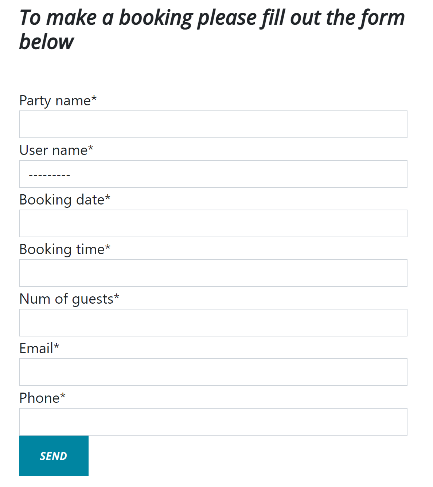
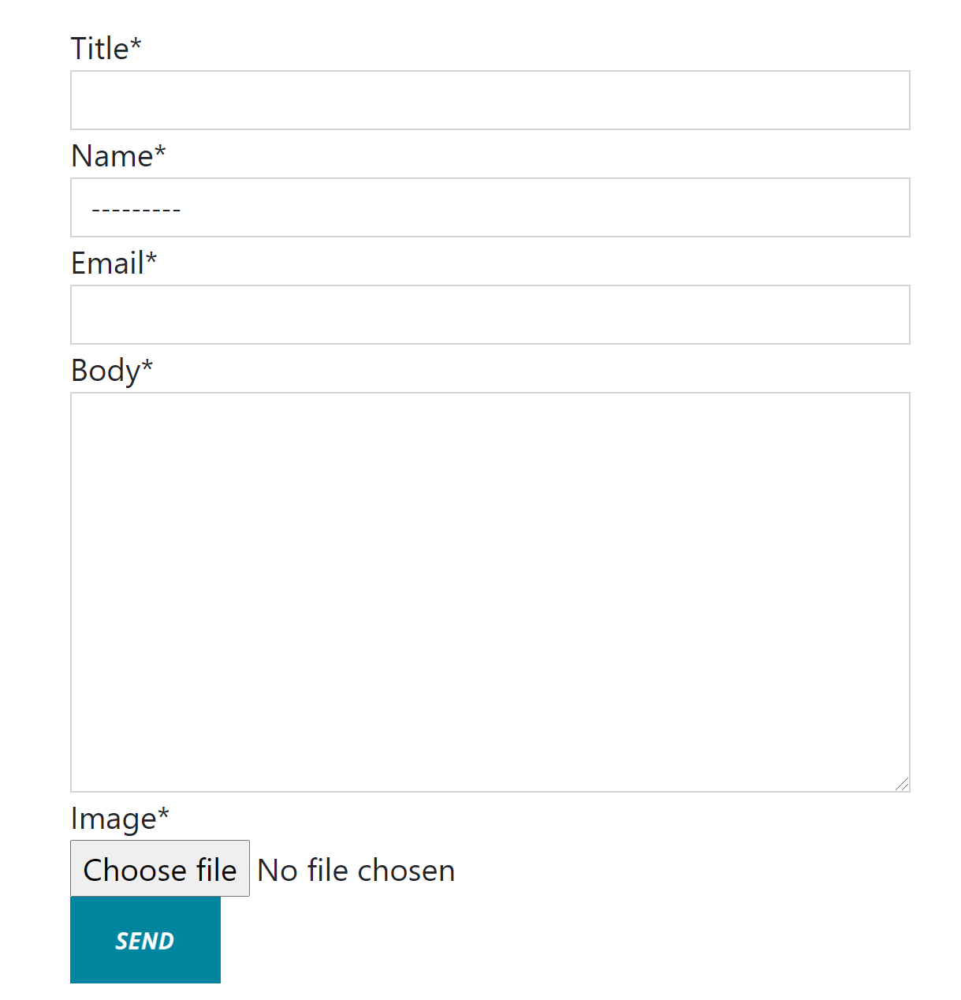

# Mark's Kitchen - A True Culinary Experience

[Please see my live app here!](https://marks-kitchen.herokuapp.com/)

## 1. Purpose of the project
The purpose of this project was to design a website which allowed a user to register for an account, book a meal in a restaurant on a particular date at a particular time and allow all users to post reviews that could be seen by all visitors of the site.

This project was my first time developing with the Django framework and was a huge undertaking for me, grasping the basic concepts was something that didn't come easy and I still have a lot more to learn on my Django journey.

## 2. User stories

The user stories for this project were written and managed using the agile kanban board function within my GitHub repository [Link here!](https://github.com/MarkReddy87/marks-kitchen/projects/1) 

I found this tool very rewarding. I was able to see my progress as I worked through each user story and moving them across each column after completion was very satisfying. Below is a list of the user stories I created:

As a site user I can view the restaurant menu so that I can see what dishes are available and at what price.
As a site user I can create an account so that I can make and save my booking.
As site admin I can confirm a booking so that I can avoid double booking a table for a specific time.
As a site user I can log into my account so that I can save my details.
As a site user I can contact the restaurant so that I can submit a review or ask a question.
As a site user I can make a booking for one or more people so that I can reserve a table for a specific date and time to have a meal.

## 3. Features

This project is a multi-page Django app. The home page has an eye catching feature image containing a welcome message as well as a sleek responsive navagation bar which is consistant across all pages. The landing page also contains the restaurants full menu for all site visitors to see.

Any site visitor is given the opportunity to register for an account which unlocks further features within the site.

A returning user who is already registered with can navigate to the login page and once the form is completed all the features of the site will be unlocked. 

Any unregistered site visitor can navigate to the "see our reviews" page where there is a collection of reviews which have been left by registers users who have had an experience's with Mark's kitchen in the past. 

If the user is registered they can login upon returning to the site and navigate to the "make a booking" page where a form will now be unlocked which will take all the necessary details from the user to make a booking in the restaurant. 

Once the user has correctly filled out the form the data is submitted and sved to the database where it will await approval from the site admin.

Also if the user is registered they can login and navigate to the "write a review page" where another from will now be unlocked. This form give the user the ability to leave a review of the restaurant and allows them to attach an image of their experience if they wish to do so. If no image is supplied the site will automatically attach a placeholer image for them.

Once the review form is correctly filled out the user will get an alert message telling them the review is awaiting approval and when approved by the admin the users review will appear on the sites "see our reviews" page for any site visitor to see. 

The site also has fully responsive footer containing all the social media links, among others, styled with icons from [Font Awsome](https://fontawesome.com/).

Finally the user can sign out of their account from the navigation bar if they wish to do so and will be prompted with a message asking them to confirm. Once confirmed the user is then redirected back to the home page.

## 4. Future Features

When thinking of potential future features to add to this site the possibilities are almost endless because of the versatility of the Django framework and I have only touched the surface of what it can do. 

I would start with an interactive gallery page which contained up to date images of the reataurant premises, menu contents and of the owner / staff with accompanying profiles. This would give the site users a great visual understanding of the restaurant as well a more far personal experience by getting to know the owner and staff without ever having visited the location.

Another feature I would like to add would be a page consisting of a payment system where a user could purchase a voucher for the restaurant which would be automatically sent to their email address and used upon arrival. 

## 5. Typography and color scheme

For this site I chose to use a bootstrap theme called "clean blog" which was downloaded from the [Start Bootstrap](https://startbootstrap.com/) website. This theme added such value to the site asthetics on so many levels. I wanted a very sleek but simple design which was also very responsive and intuative at the same time and I feel this theme did it all. I modified the html code in theme from its original state and used custom images and CSS to make it my own but the theme helped getting the navigation bar and the footer to look the way I wanted it to. 

I chose to use simple and contrasting colors which I think helps the sites readability and promotes a positive user response. The teo [Google Fonts](https://fonts.google.com/) I used which I thought paired well together were Lato and Open Sans.

## 6. Wireframes

## 7. Technology

## 8. testing
   8.1 code validation
   8.2 test cases (user story based with screenshots)
   8.3 fixed bugs
   8.4 supported screens and browsers

## 9. Deployment
   9.1 via gitpod
   9.2 via heroku

## 10. credits